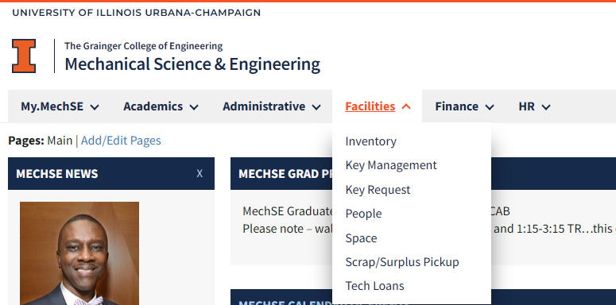
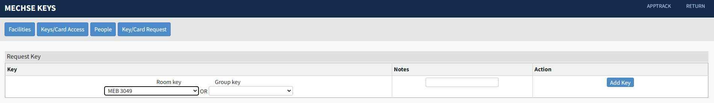
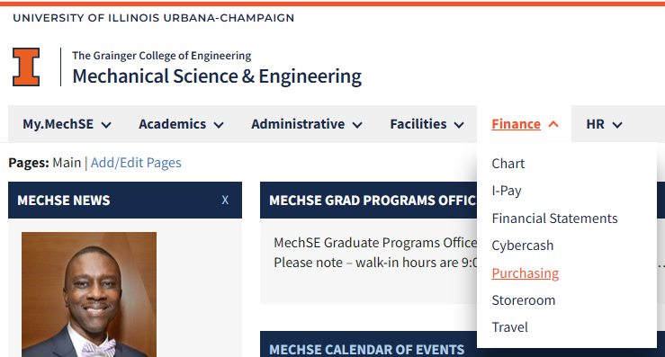
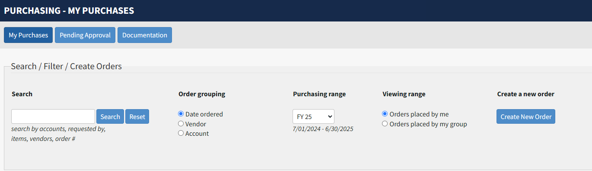

# Working with the MechSE Department

- [Keys and Card Access](#keys-and-card-access)
- [Purchasing Requests](#purchasing-requests)

## MyMechse

The [my.mechse](https://my.mechse.illinois.edu/) website is the homepage for most of the resources you will use to interact with the administrative side of the department. On this site you can request keys/swipe access to different rooms in MEL and MEB, submit purchasing requests, create travel requests, complete your semesterly TA preference form, perform your yearly self-evaluation, and view your class schedule and other records. 

## Keys and Card Access

You will need to request keys and/or card access for some rooms at MEL or LUMEB including the lab (MEL 1218) and your office space. To request a physical key navigate to the "Key Request" page under the "Facilities" tab on the my.mechse site.

From the "Room Key" or "Group Key" drop down menu you can select the key that you are requesting and click "Add Key"

Your request will be sent for approval, once it has been approved you will receive an email that lets you know when you can pick up the requested key. Keys can be picked up from the facilities/reciving office located in LUMEB 1220. 

To request card access, email MechSE Facilities at (mechse-facilities@illinois.edu) and using the subject line "I-card Access for X Room" and include your University Identification Number (UIN) and I-card number both of which can be found on your I-card. For our lab spaces (such as MEL 1218) also copy Bill on your email. 

Please note that there will be some processing time for both key and card access requests. 

## Purchasing Requests

You will likely need to buy supplies or parts through during the course of your research which means submitting a purchase request to the MechSE business office. To start a purchase request, navigate to the "Purchasing" page under the "Finance" tab on the my.mechse site. On this page you will be able to view all purchase orders you have sumitted and track the progress of open orders.

Click on the "Create New Order" button to start a new purchase request. 

From here fill out the requested information:

- Personal Infomration
    - Name and phone number
- Account information
    - Use the appropriate CFOP account number for the purchse, if you are unsure which CFOP to use contact Bill before submitting your order
- Vendor Information
    - It is best to stick with the departmental list for vendors, you will likely be able to find what you need from one of these vendors
    - If you are ordering from multiple vendors you will need to submit multiple purchase requests
- Items
    - Add each item with the appropriate information
    - If you have a quote you can upload the document using the "Upload a Quote" button, but you still need to add each line item from the quote into the purchasing system
- Delivery Information
    - Usually this can be left with the defaults which will ship to the MechSE receiving office
    - You can add proxy pickups if you need someone else to pick up your delivery
- Review & Submit
    - You are required to give a business justification for your purchase before you can submit the purchase request. There is no need to give a detailed description here, just a short justification for why you are purchasing what you are purchasine(i.e. purchasing supplies for buidling a new experimental setup)

Once you have entered and checked all of the information, you can submit the order. The request will be sent to the approver for the account who will review the request and approve it if there are no issues. The order will then go to the business office and they will complete the order with the copmany. If there are any issues in the ordering process the business office may reach out to you via email. 

The order internal status can be tracked on the purchasing page. For orders with pysical deliveries, once the delivery arrives, it is processed by the receiving office and delivered to the appropriate room. In some cases you may need to go to the reciving office (LUMEB 1220) to pickup your package. 
