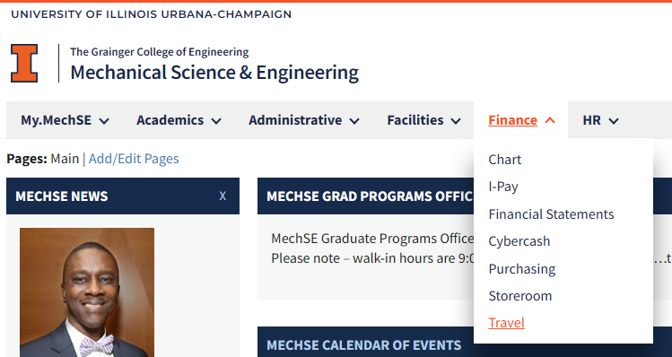
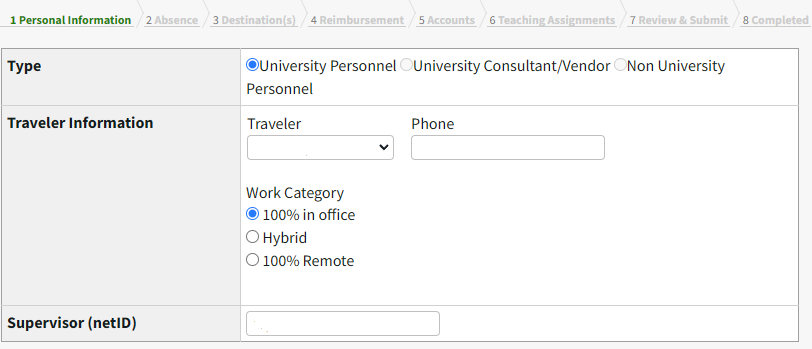
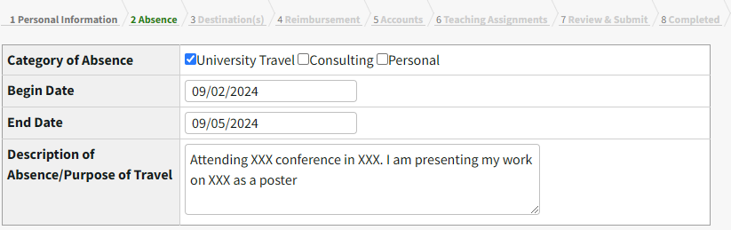
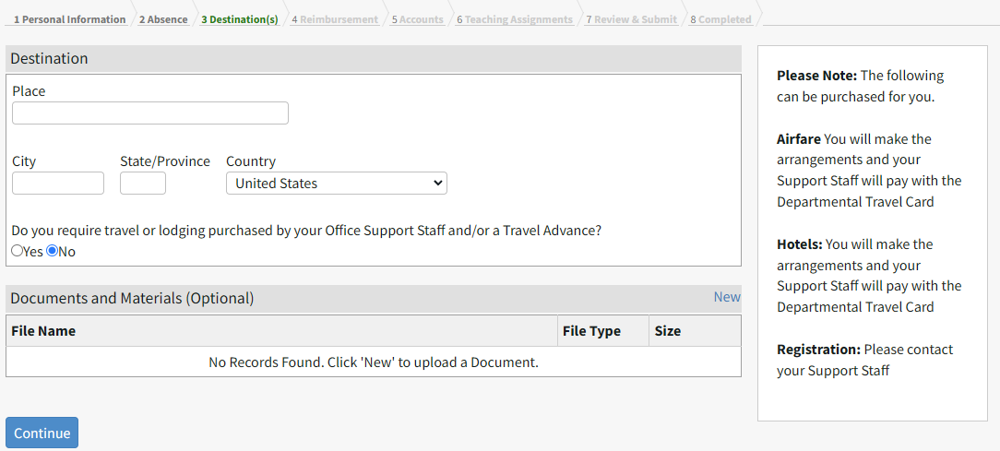
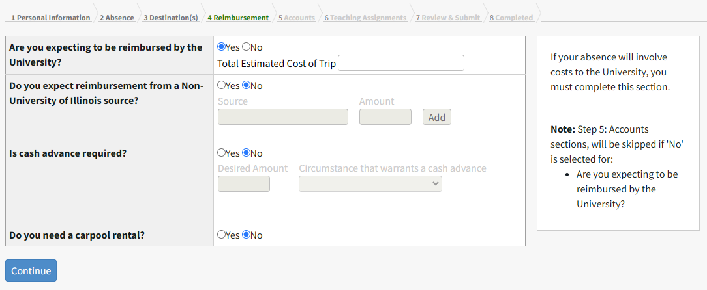

# Working with the MechSE Department

- [Keys and Card Access](#keys-and-card-access)
- [Room Reservations](#room-reservations)
- [Purchasing Requests](#purchasing-requests)
- [Travel Requests](#travel-requests)
- [Reimbursment](#reimbursement)

## MyMechse

The [my.mechse](https://my.mechse.illinois.edu/) website is the homepage for most of the resources you will use to interact with the administrative side of the department. On this site you can request keys/swipe access to different rooms in MEL and MEB, submit purchasing requests, create travel requests, complete your semesterly TA preference form, perform your yearly self-evaluation, and view your class schedule and other records. 

## Keys and Card Access

You will need to request keys and/or card access for some rooms at MEL or LUMEB including the lab (MEL 1218) and your office space. To request a physical key navigate to the "Key Request" page under the "Facilities" tab on the my.mechse site.

From the "Room Key" or "Group Key" drop down menu you can select the key that you are requesting and click "Add Key"

Your request will be sent for approval, once it has been approved you will receive an email that lets you know when you can pick up the requested key. Keys can be picked up from the facilities/reciving office located in LUMEB 1220. 

To request card access, email MechSE Facilities at (mechse-facilities@illinois.edu) and using the subject line "I-card Access for X Room" and include your University Identification Number (UIN) and I-card number both of which can be found on your I-card. For our lab spaces (such as MEL 1218) also copy Bill on your email. 

Please note that there will be some processing time for both key and card access requests. 

## Room Reservations

If you would like to reserve a conference room, please email (mechse-sso@illinois.edu) with the purpose/name, date(s), time(s), number of people, and any AV requests.  Classroom reservation requests should be sent to Robbie Vermillion (rvermil2@illinois.edu).

## Purchasing Requests

You will likely need to buy supplies or parts through during the course of your research which means submitting a purchase request to the MechSE business office. To start a purchase request, navigate to the "Purchasing" page under the "Finance" tab on the my.mechse site. On this page you will be able to view all purchase orders you have sumitted and track the progress of open orders.

Click on the "Create New Order" button to start a new purchase request. 

From here fill out the requested information:

- Personal Infomration
    - Name and phone number
- Account information
    - Use the appropriate CFOP account number for the purchse, if you are unsure which CFOP to use contact Bill before submitting your order
- Vendor Information
    - It is best to stick with the departmental list for vendors, you will likely be able to find what you need from one of these vendors
    - If you are ordering from multiple vendors you will need to submit multiple purchase requests
- Items
    - Add each item with the appropriate information
    - If you have a quote you can upload the document using the "Upload a Quote" button, but you still need to add each line item from the quote into the purchasing system
- Delivery Information
    - Usually this can be left with the defaults which will ship to the MechSE receiving office
    - You can add proxy pickups if you need someone else to pick up your delivery
- Review & Submit
    - You are required to give a business justification for your purchase before you can submit the purchase request. There is no need to give a detailed description here, just a short justification for why you are purchasing what you are purchasing (i.e. purchasing supplies for buidling a new experimental setup)

Once you have entered and checked all of the information, you can submit the order. The request will be sent to the approver for the account who will review the request and approve it if there are no issues. The order will then go to the business office and they will complete the order with the copmany. If there are any issues in the ordering process the business office may reach out to you via email. 

The order internal status can be tracked on the purchasing page. For orders with pysical deliveries, once the delivery arrives, it is processed by the receiving office and delivered to the appropriate room. In some cases you may need to go to the reciving office (LUMEB 1220) to pickup your package. 

## Travel Requests

If you are attending a confrence or have other university travel, you must submit a travel request well in advance of the dates you will be gone. It is required to complete the travel request if you are hoping to be reimbursed for any of your travel, without the documented request your reimbursement will not be approved. See the [Business Travel Guide](Guides/BusinessTravelGuide.pdf) and the [Travel App Guide](Guides/TravelAppGuide.pdf) for details. Basic instructions are also shown below.

A travel request can be submitted from the my.mechse site. Navigate to the "Travel" page under the "Finance" tab.

Click on the "Create Request" button to start a new travel request. 

In the "Personal Information Section" select "University Personnel" and "100% in office" and enter the rest of the personal information 

In the "Absence" section select "University travel" and enter the dates of your travel and a short description of the travel.

In the "Destination(s)" section enter the location to which you are traveling. If you are having the business office book flights, hotels, or pay for confrence registrations select "Yes" for the question "Do you reqire travel or lodging purchased..." and complete the required information. 

In the "Reimbursment" section enter the estimated cost of the trip. This should include things such as airfair, hotels, confrence registration, meals, rideshares to/from the venue, etc.

In the "Accounts" section enter the appropriate CFOP account number. Again, if you are unsure which CFOP to use contact Bill. 

If you have any teaching assignments complete the required information in the "Teaching Assignments" section. If you are TAing, ensure that you have permission from the lead instructor and have made arragments to cover any requried responsibilities (i.e. office hours, lab sections) before your travel. 

Once all the information has been completed, you can review and submit your request. The request will be sent for approval by Bill and the business office. 

Once your travel request is approved in the Travel App, please send the Travel ID number and all related documentation (conference registration, lodging, flight information and conference agendas) to mechse-business@illinois.edu.  Please work with the Business Office as much as possible to arrange travel ahead of time using university procurement methods, reducing the need for reimbursements.

Other travel reminders from the buisiness office:

- All international travel requires additional review and pre-approval from University International Safety and Security and our Unit Executive Officer.  We will send you details on that process once the request is submitted in the Travel App.
- All travel must be by the most direct route, using the most economical mode of transportation.  This includes only choosing economy seating and basic ride share services.  Any surcharges and upgrades must be paid for by the employee.
- University policy allows for you to arrive one day before and leave one day after a conference for university business travel.  If you exceed that approved period of business travel, a justification will need to be provided along with a price comparison for airfare costs (if airfare was purchased).  Any travel beyond that time is considered personal and must be paid for by the employee. 
- If meals are provided at the conference/business event, they must be deducted from per diem requests.
- When renting a car for domestic travel, optional insurance coverage and damage waivers will not be reimbursed.
- Shared Travel Expenses - Business travel expenses should be reimbursed to the individual who incurred them. Please do not pay for travel expenses on behalf of someone else and seek reimbursement. The only exception to that is regarding shared lodging; you may cover the costs of a shared hotel room as long as only one traveler seeks reimbursement for the entire lodging expense. 

## Reimbursement

For travel expense reimbursements you should contact the MechSE business office (mechse-business@illinois.edu). In your email you should include the Travel ID number from your travel approval, any non-food related reciepts you have (airfare, hotel, rideshares, etc.), and a list of any meals provided by the confrence/event you attended. The business office will process the reimbursement in the Chrome River system. Reimbursements may take several weeks to process. 